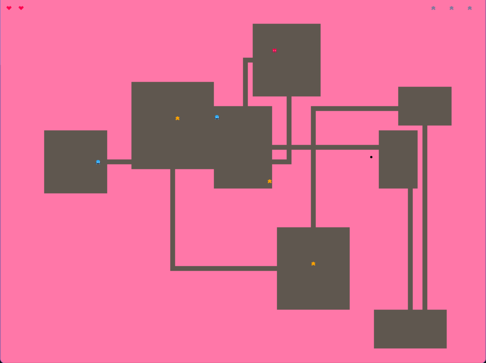

# Labirinto das Estrelas

Pequeno jogo em Pygame Zero (pgzrun). O jogador explora um labirinto gerado proceduralmente, coleta estrelas, evita monstros e tem um sistema de vidas (corações). Possui um menu com botões de iniciar, volume e sair.

## Como rodar
Requisitos:
- Python 3.8+ (recomendo 3.10+)
- Pygame e Pygame Zero

Instale dependências (se ainda não tiver):

```powershell
pip install pygame pgzero
```

Para executar o jogo (no Windows PowerShell):

```powershell
pgzrun testePython.py
```

> Observação: execute o comando no diretório onde está o arquivo `testePython.py`.

## Estrutura de pastas
Descrevo abaixo as pastas presentes no workspace e o propósito de cada uma (conforme estavam no repositório):

- `images/` — coloque aqui todos os sprites e imagens do jogo (personagem, monstros, corações, estrelas, tiles `chao` e `parede`, ícones de volume/saída, etc.). Os nomes usados no código são, por exemplo: `personagem1.png`, `personagem2.png`, `personagem5.png`, `personagem4.png`, `monstro_1.png`, `estrela_cheia.png`, `estrela_vazia.png`, `coracao_cheio.png`, `coracao_vazio.png`, `chao.png`, `parede.png`, `volume.png`, `mudo.png`, `sair.png`.

- `sounds/` (ou `audio/`) — coloque aqui os arquivos de som e música: `audio_jogo.ogg` (música do menu), `audio_inicio.ogg` (música do jogo) e efeitos como `eep.wav`.
  
- `testePython.py` — arquivo principal do jogo (Pygame Zero). Contém a lógica do menu, geração procedural do mapa, entidades (player, monstros, estrelas), HUD e controles de áudio.


## Controles
- Setas do teclado: mover o personagem (esquerda/direita/cima/baixo).
- Mouse: clicar em Iniciar, alternar volume e sair no menu.

## Comportamento de áudio
- O menu tem sua trilha (`audio_jogo`) e o jogo tem outra (`audio_inicio`).
- O botão de volume alterna entre mudo e som, aplicando o estado para todas as faixas carregadas.

## Jogabilidade


  
